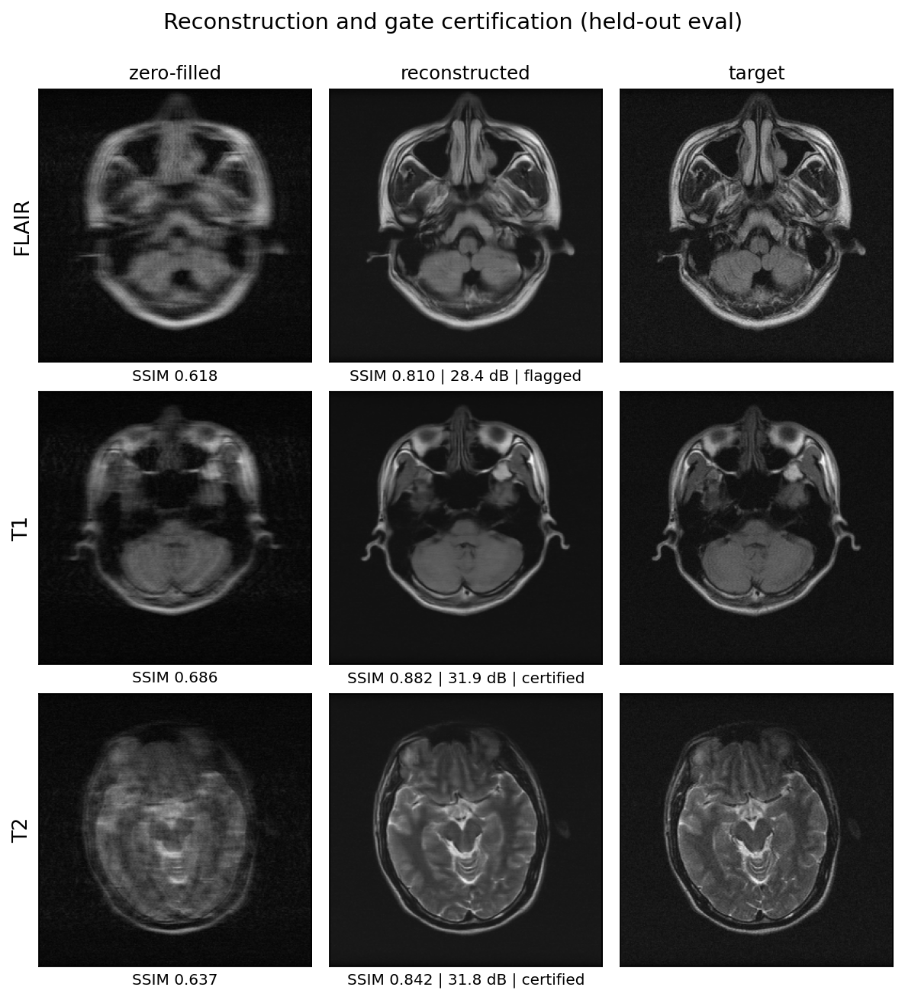
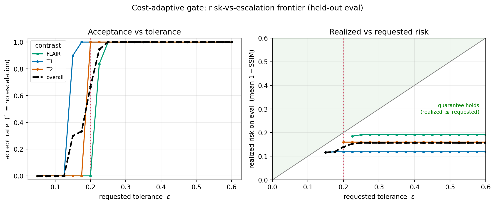
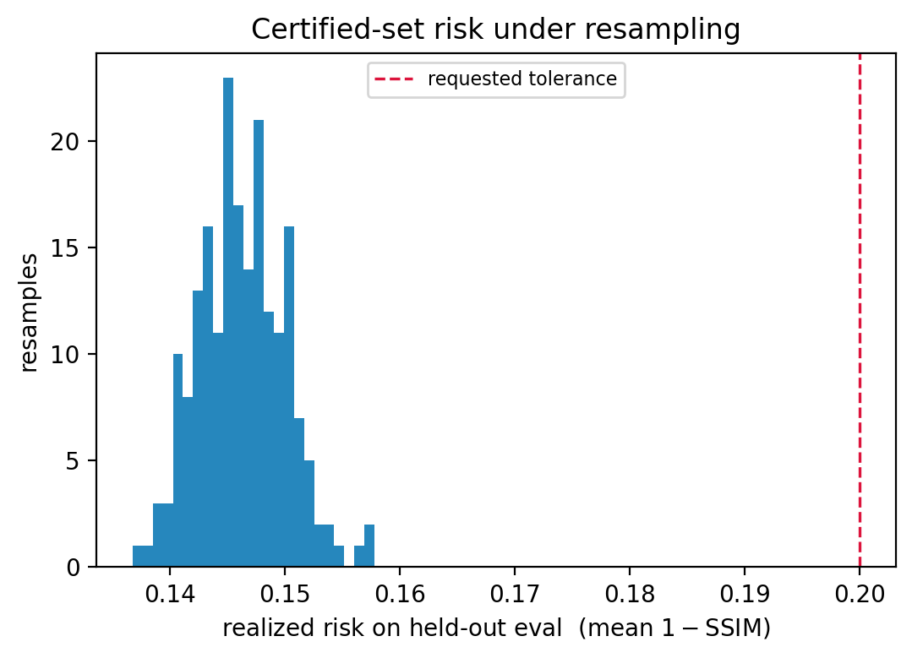

# Risk-Controlled Certification for Accelerated Low-Field MRI Reconstruction

This project focuses on reconstructing accelerated low-field brain MRI scans and, for each slice, determining which reconstructions are reliable. A cost-effective reconstructor processes every slice, while a risk-controlled gate verifies the slices it deems trustworthy, offering a coverage guarantee and flagging others for review. This gate is the main contribution of the project. The study specifically targets the M4Raw low-field dataset, characterized by high noise levels where dependable quality control is crucial.

## How the system operates

The system has three parts.

The initial component is a cheap reconstructor, where “cheap” refers to low computational cost per slice, not image quality. It is a CNN-based end-to-end variational network that learns coil sensitivity maps and uses sensitivity-weighted data consistency. It processes a single undersampled, single-repetition slice and produces a magnitude image in one forward pass.

The second component is a risk-controlled gate. For each slice, the reconstructor calculates a data-consistency residual, which the gate uses as an uncertainty score. On a separate calibration set, the gate determines one threshold per contrast, ensuring the certified set's mean structural error stays within the specified tolerance. This bound is an empirical-Bernstein bound with a Bonferroni correction across a small set of candidates, providing a high-probability guarantee rather than relying on heuristics.

The third component is the certify-or-flag decision. During testing, each slice is certified if its score is below its contrast threshold; otherwise, it is flagged. Flagged slices are forwarded for review or additional acquisition. The gate represents the contribution of this project.

## Architecture

The reconstructor is based on Sriram et al.'s end-to-end variational network, containing approximately 12.9 million parameters. A small network first estimates coil sensitivity maps from the fully sampled center of k-space, known as the autocalibration region, and normalizes them so that the coil energy per pixel sums to one. This is followed by five cascades where each one refines the k-space estimate through a learned data-consistency step aligned with the measured lines and a CNN correction in the sensitivity domain. This iterative process guides the estimate closer to both the actual measurements and the learned image prior. The final image is obtained by computing the root-sum-of-squares of the output from the last cascade, which matches the magnitude domain used by the gate and the metrics.

The uncertainty score represents the average absolute data-consistency gap on the measured lines. It requires no additional network or forward passes; a single scored pass provides both the image and the score. This approach ensures that training, calibration, and evaluation all measure the same consistent quantity.

## The gate

For each contrast, the gate sorts the calibration slices by their scores and explores a small grid of acceptance fractions. At each grid point, it computes an empirical-Bernstein upper bound on the mean structural error of the accepted set. This bound uses the sample mean and variance of the error, so it is tight when the errors are small and stable. A Bonferroni correction across the grid ensures the validity of the guarantee even when the threshold is selected from the data. The gate then chooses the largest threshold for which the bound remains below the tolerance, accepting as many slices as the guarantee permits.

The primary parameter is the grid size. A coarser grid results in a smaller multiplicity penalty, making the bound tighter and increasing acceptance, though at the expense of precision in threshold resolution. This run utilizes eight grid points. If too few calibration slices are available, the process defaults to full escalation, which is the safest approach.

Thresholds are fitted for each contrast individually rather than globally for all slices. This is the principle behind the Mondrian approach, which reveals the actual per-contrast behavior instead of letting an easier contrast temporarily support a more challenging one.

## Data

The dataset used is M4Raw, a low-field brain MRI collection captured at 0.3 tesla, featuring four receive coils and three different contrasts: T1, T2, and FLAIR. Each scan includes multiple repetitions, with the clean target for each slice being the average of these repetitions. Input slices are undersampled at four times the acceleration, except for a fully sampled center region. The data is divided at the subject level into train, monitor, calibrate, and eval groups, ensuring that no subject appears in more than one category.

## Results

On the held-out eval split, the reconstructor significantly surpasses the naive baseline in image quality. The zero-filled baseline records 24.66 dB PSNR, 0.639 SSIM, and 0.0713 NMSE, while the reconstructor achieves 31.65 dB, 0.843 SSIM, and 0.0149 NMSE.

The panel below displays the median slice for each contrast on the held-out eval split. Each row presents the zero-filled input, the reconstruction, and the target, along with the gate verdict on the reconstruction.



The gate was run at a tolerance of 0.20 on mean one-minus-SSIM. The table below shows the certified fraction and the realized risk per contrast on held-out data.

| contrast | certified | realized risk  | AUROC     | AURC  |
|----------|-----------|----------------|-----------|-------|
| T1       | 100%      | 0.119          | undefined | 0.105 |
| T2       | 100%      | 0.160          | 0.69      | 0.153 |
| FLAIR    | 0%        | not applicable | 0.78      | 0.171 |
| overall  | 66.7%     | 0.139          |           |       |


Every certified set has achieved risk levels below the requested tolerance of 0.20. Specifically, T1 is at 0.119, T2 at 0.160, and the overall certified set at 0.139. This is the main outcome. The coverage guarantees ensure that calibrations transfer effectively to held-out data.

AUROC evaluates how effectively the residual score distinguishes slices that exceed the tolerance from those that do not. An AUROC of 0.5 indicates performance no better than chance, while 1.0 signifies perfect separation. In this context, T2 has an AUROC of 0.69 and FLAIR 0.78, showing that the residual rankings reliably place failing slices above passing ones—most effectively with FLAIR, which presents the most challenging contrast. The T1 AUROC is undefined because no T1 slice exceeds the error tolerance, meaning there are no failures to rank. This suggests consistent good T1 reconstruction rather than an issue. FLAIR risk assessment isn’t possible because no FLAIR slices are certified, leaving no set for evaluation.

AURC fills the gap left by AUROC. It represents the area under the risk-coverage curve, assessing how effectively the residual order slices by error at each acceptance level, with lower values indicating better performance. AURC remains defined for T1 at 0.105, even when AUROC is undefined, and it ranks the contrasts by difficulty in the order of T1, T2, then FLAIR, aligning with the certification sequence.

Additionally, increasing the tolerance from 0.05 to 0.60 highlights the complete tradeoff. The left panel shows how acceptance rises as the cutoff becomes more lenient, while the right panel indicates that the actual risk stays within the guarantee region across the entire range.




Each contrast confirms that over half of its slices meet the criterion once the tolerance surpasses a specific threshold. T1 reaches this threshold at 0.150, T2 at 0.200, and FLAIR at 0.225. The order reflects the relative physical difficulty of the contrasts, with T1 being the easiest and FLAIR the hardest at low field. Throughout all swept tolerances, the actual risk remains below the target risk, ensuring the guarantee is valid across the entire operating range, not just at a single point.

## Robustness
The guarantee should be valid across resampling, not just on one calibration and evaluation split. To confirm this, scores are calculated once, then the calibration and evaluation sets are resampled 200 times at the subject level. The gate is refitted on each resampling, and the actual risk of the certified set is recorded on the holdout side. Since the split always occurs at the subject level, no patient moves between calibration and evaluation.



Every resample accepted slices, and the realized risk of the certified set stayed at or under the tolerance each time. The risk clusters near 0.145 and never approaches the 0.20 line, so the guarantee held in 100% of resamples against a target of 90%. The single-split result is therefore not a lucky draw.

## Limitations and future work

The shipped system includes the reconstructor and the gate. The escalation stage meant to repair flagged slices isn’t part of it, which is a measured outcome rather than a flaw. Two escalation models were tested: one was a self-supervised denoiser trained on independent repetition pairs, and the other was a supervised refiner trained against the clean multi-repetition target. Neither model improved the flagged FLAIR slices. The inexpensive reconstructor already removes most recoverable noise from a single low-field scan and is actually cleaner than the multi-repetition reference it’s evaluated against, so a single-contrast model offers no additional value. The flagged contrast is just above the operational threshold (~0.225), leaving little headroom. However, this is not the case for noisier acquisitions. The system correctly flags these slices, which is its intended behavior.

Three directions could move the flagged contrast.

The first approach involves multi-contrast reconstruction. T1 and T2 images of the same subject reconstruct effectively and share anatomical features with FLAIR, so conditioning FLAIR on them could incorporate information that a single contrast cannot provide. However, this requires alignment of the contrasts to the same slice, which was beyond the scope of this work. 

The second approach uses a generative prior, such as a diffusion model combined with data consistency, paired with a null-space hallucination metric to quantify the accuracy of generated structures rather than hidden ones. Because the dataset is small, physics-aware augmentation would be necessary for a from-scratch prior. 

The third approach focuses on acquisition-side escalation, where slices flagged as problematic are repeated more times and improve signal quality through averaging rather than relying solely on a model.

## Running the model

The scripts run in order, and each step writes the inputs the next step needs.

```bash
python data/data_processing.py   # device preflight, run once before a long job
python src/train.py              # train the cheap reconstructor
python evaluation/calibrate.py   # fit the per-contrast gate
python evaluation/eval.py        # certification report and reconstruction panel
python evaluation/sweep.py       # risk and certification frontier
```

Start with the preflight check first. It performs the complex k-space processing on the active device and indicates pass or fail. This is especially important on Apple silicon, where support for complex FFT has differed across PyTorch versions. On CUDA or CPU, it provides a quick confirmation. The training step is resumable, so if it halts, you can rerun it and it will continue from the latest checkpoint.

## Containerized workflow

The evaluation environment operates within a container to ensure reproducibility. The image encompasses calibration, the evaluation report, the risk sweep, and the test suite, forming the foundation for a demo. M4Raw files and model checkpoints are mounted at runtime instead of being embedded, keeping the image lightweight and portable. 

However, the training runs on the host hardware rather than inside the container. On a Mac, the container cannot access the Metal backend, so it defaults to CPU, which is acceptable for single-pass evaluation but too slow for training. Therefore, training remains on the host. The same image can be built with a CUDA wheel for GPU hosts without modifying the code.


```bash
docker compose build                 # build the image
docker compose run --rm calibrate    # fit the per-contrast gate
docker compose run --rm eval         # certification report and panel
docker compose run --rm sweep        # risk and certification frontier
docker compose run --rm test         # unit tests
```

A GitHub Actions workflow rebuilds the image with each push, executes the test suite inside it, and verifies that the reconstructor generates identical images using both its forward and scored paths. The full details about data mounts, the host accelerator note, and the CUDA path are provided in DOCKER.md.

## Repository layout

```
data/
  data_processing.py             k-space transforms, undersampling, clean targets, device preflight
src/
  reconstructor.py               the cheap end-to-end variational network
  gate.py                        empirical-Bernstein risk control and the certify decision
  metrics.py                     shared SSIM, PSNR, NMSE, AUROC, and AURC
  train.py                       training for the reconstructor
evaluation/
  calibrate.py                   fit the per-contrast gate on the calibration split
  eval.py                        certification report and reconstruction panel
  sweep.py                       risk frontier and the resampling check
artifacts/
  recon_panel.png                per-contrast reconstruction and gate panel
  risk_escalation_frontier.png   acceptance and realized risk across tolerances
  risk_guarantee_resampling.png  certified-set risk across resampled splits
EDA/EDA.ipynb                        exploratory analysis of the dataset
Dockerfile                       CPU image for eval, calibrate, sweep, and test
docker-compose.yml               per-stage services with data and checkpoints mounted
.dockerignore                    keeps data, checkpoints, and artifacts out of the image
requirements-dev.txt             test-only dependency, pytest
DOCKER.md                        container usage and the CUDA path
.github/workflows/
  ci.yml                         native test job
  docker-image.yml               builds and tests the image on each push
```

## Reproducibility

All randomness is seeded where it is generated, with subject-level, disjoint splits, and consistent scoring functions across evaluation scripts, ensuring safe comparison of numbers. All paths are relative, and the code operates on Apple silicon, CUDA, or CPU without modifications. The preflight verifies the complex k-space paths on the active device before a lengthy run. The container provides a fixed environment for the evaluation stages, so the reported numbers reproduce on any machine that can run Docker.

## References

The shipped design draws on the following work.

1. M4Raw is a multi-contrast, multi-repetition, multi-channel low-field brain k-space dataset. Lyu et al., Scientific Data, 2023.
2. End-to-end variational networks are the reconstruction backbone used here. Sriram et al., MICCAI, 2020.
3. The fastMRI dataset and benchmarks established the accelerated MRI reconstruction setup. Knoll et al., Radiology Artificial Intelligence, 2020.
4. SSIM measures structural similarity and defines the error used here. Wang et al., IEEE Transactions on Image Processing, 2004.
5. Empirical Bernstein bounds with sample-variance penalization give the gate its tail bound. Maurer and Pontil, COLT, 2009.
6. Distribution-free risk-controlling prediction sets frame the certify decision. Bates et al., Journal of the ACM, 2021.
7. Learn then Test calibrates predictive algorithms to achieve risk control. Angelopoulos et al., 2021.
8. Mondrian confidence machines are the per-group idea behind the per-contrast thresholds. Vovk et al., 2003.

The escalation study and the future-work directions draw on the following.

9. Noise2Noise learns image restoration without clean data. Lehtinen et al., ICML, 2018.
10. Rep2Rep extends Noise2Noise to repeated low-field MRI acquisitions. Janjušević et al., Magnetic Resonance in Medicine, 2026.
11. Physics-aware data augmentation helps deep accelerated MRI with limited data. Fabian et al., ICML, 2021.
12. The null-space hallucination map measures invented structure in tomographic reconstruction. Bhadra et al., IEEE Transactions on Medical Imaging, 2021.

